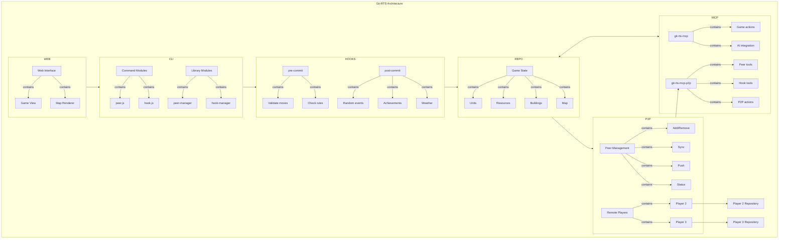
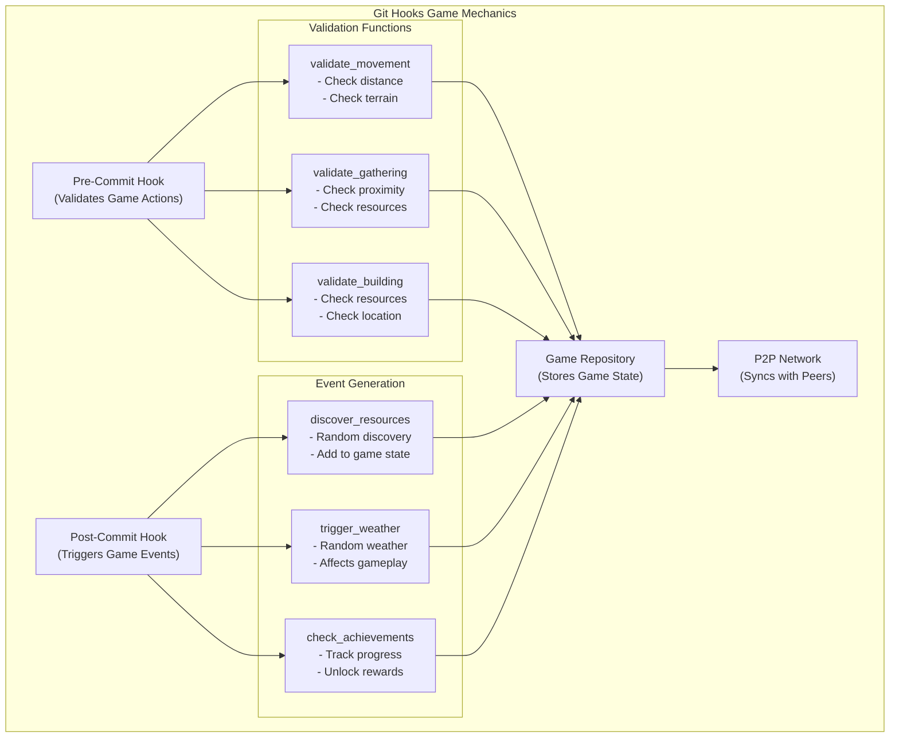

# Git-RTS: A Git-based Real-Time Strategy Game

<div align="center">
  <!-- Note: Image placeholder - replace with actual image -->
  <pre>
   ______   _   _______        _____   _______   _____
  / _____| | | |__   __|      |  __ \ |__   __| / ____|
 | |  ___  | |    | |         | |__) |   | |   | (___
 | | |_  | | |    | |         |  _  /    | |    \___ \
 | |__| | | |    | |         | | \ \    | |    ____) |
  \_____| |_|    |_|         |_|  \_\   |_|   |_____/
                                        
 Where Git Meets Strategy Gaming
  </pre>
  <br>
  <strong>Where Git Meets Strategy Gaming</strong>
  <br><br>
  
  [](https://opensource.org/licenses/MIT)
  [](CONTRIBUTING.md)
  [](https://discord.gg/git-rts)
  [](https://twitter.com/git_rts)
</div>

## 🎮 Overview

**Git-RTS** is a revolutionary real-time strategy game that uses Git as its underlying game engine. Players control units, gather resources, and build structures—all through Git operations. Every game action is a commit, every player has their own branch, and game synchronization happens through merges.

<div align="center">
  <!-- Note: Image placeholder - replace with actual gameplay screenshot -->
  <pre>
  [This is a placeholder for the gameplay screenshot]
  The actual game interface would show units, resources, and the game map.
  </pre>
</div>

### Why Git-RTS?

- **Innovative Gameplay**: Experience strategy gaming through the lens of distributed version control
- **Complete History**: Every game action is recorded in the Git history
- **Offline Play**: Make moves offline and synchronize when you reconnect
- **Decentralized Multiplayer**: Play with others without a central server using peer-to-peer networking
- **Automated Game Events**: Git hooks trigger random events and validate game actions
- **Extensible**: Easy to mod and extend with new units, buildings, and mechanics
- **Educational**: Learn Git concepts while having fun

## 🚀 Quick Start

### Prerequisites

- Node.js 14.x or higher
- Git 2.20 or higher
- GitHub account (for multiplayer features)

### Installation

```bash
# Clone the repository
git clone https://github.com/git-rts/git-rts.git
cd git-rts

# Install dependencies
npm install

# Link the CLI globally
npm link
```

### Creating Your First Game

```bash
# Create a new game
git-rts create-game https://github.com/yourusername/my-rts-world.git "My RTS World"

# Create a player
git-rts create-player "Player One"

# Start the web interface
cd git-rts-web
npm start

# Open your browser to http://localhost:3000
```

### Using Peer-to-Peer Features

```bash
# Install Git hooks for game mechanics
git-rts hook install --all

# Add a peer to your network
git-rts peer add "Player Two" https://github.com/otherplayer/their-rts-world.git

# Synchronize with peers
git-rts peer sync --all

# Check peer status
git-rts peer status --all
```

<div align="center">
  <!-- Note: Image placeholder - replace with actual game creation animation -->
  <pre>
  [This is a placeholder for the game creation animation]
  The animation would show the process of creating a new game.
  </pre>
</div>

## 🏗️ Architecture

Git-RTS consists of several components that work together to create a seamless gaming experience:

### Architecture Diagram



### Git Hooks Game Mechanics



### Components

- **CLI Tools**: Command-line interface for game actions
- **MCP Server**: Model Context Protocol server for AI integration
- **Web Interface**: Browser-based game visualization
- **Game Repository**: Git repository storing the game state
- **P2P Network**: Decentralized peer-to-peer network for multiplayer

### Game Mechanics

Git-RTS leverages Git's distributed nature to implement game mechanics:

- **Branches**: Each player has their own branch
- **Commits**: Game actions are recorded as commits
- **Merges**: Turn synchronization happens through merges
- **Pull Requests**: Special actions like alliances and trades
- **Git Hooks**: Automated game events and validations
- **Peer-to-Peer**: Decentralized multiplayer without a central server

## 🎲 Gameplay

### Resources

Players gather four types of resources:

- **Gold**: Used for advanced units and technologies
- **Wood**: Basic building material
- **Stone**: Used for defensive structures
- **Food**: Sustains your population

### Units

Various units with different abilities:

- **Settlers**: Gather resources and build structures
- **Warriors**: Basic combat units
- **Archers**: Ranged combat units
- **Cavalry**: Fast-moving combat units
- **Siege Engines**: Powerful units that can destroy buildings

### Buildings

Construct various buildings:

- **Town Center**: Main building, produces settlers
- **Barracks**: Trains military units
- **Market**: Enables resource trading
- **University**: Researches technologies
- **Walls and Towers**: Defensive structures

## 🧩 RESTful Hypermedia API

Git-RTS implements a RESTful hypermedia API using the Hydra vocabulary:

```json
{
  "@context": {
    "hydra": "http://www.w3.org/ns/hydra/core#",
    "game": "https://player1.github.io/my-rts-world/ontology#"
  },
  "@type": "game:Unit",
  "@id": "game:unit1",
  "game:name": "Warrior",
  "game:attack": 10,
  "hydra:operation": [
    {
      "@type": "hydra:Operation",
      "hydra:method": "POST",
      "hydra:title": "Move Unit",
      "hydra:description": "Moves this unit to a new position"
    }
  ]
}
```

This API enables:

- **Self-discovery**: Clients can explore available actions
- **Semantic meaning**: Resources have well-defined semantics
- **AI integration**: AI assistants can interact with the game

## 🛠️ Development

### Project Structure

```
git-rts/
├── git-rts-cli/       # Command-line interface
├── git-rts-mcp/       # MCP server
├── git-rts-mcp-p2p/   # Enhanced P2P MCP server
├── git-rts-web/       # Web interface
├── hooks/             # Git hook templates
└── docs/              # Documentation
```

### Running Tests

```bash
# Run all tests
npm test

# Run specific test suite
npm test -- --suite=game-mechanics
```

### Building from Source

```bash
# Build all components
npm run build

# Build specific component
npm run build:cli
```

## 🤝 Contributing

We welcome contributions from everyone! Check out our [Contributing Guide](CONTRIBUTING.md) to get started.

### Development Roadmap

- [x] Basic game mechanics
- [x] RESTful hypermedia API
- [x] Web interface
- [x] Peer-to-peer architecture
- [x] Git hooks for game mechanics
- [ ] Advanced combat system
- [ ] Technology tree
- [ ] Diplomacy and alliances
- [ ] Campaign mode
- [ ] AI opponents

## 📚 Documentation

- [Architecture Guide](docs/architecture.md)
- [API Reference](docs/api-reference.md)
- [Game Mechanics](docs/game-mechanics.md)
- [Modding Guide](docs/modding.md)

## 🌟 Showcase

<div align="center">
  <!-- Note: Image placeholders - replace with actual screenshots -->
  <table>
    <tr>
      <td>
        <pre>
[Screenshot 1 placeholder]
Game interface showing resource management
        </pre>
      </td>
      <td>
        <pre>
[Screenshot 2 placeholder]
Game interface showing combat
        </pre>
      </td>
    </tr>
    <tr>
      <td>
        <pre>
[Screenshot 3 placeholder]
Game interface showing building construction
        </pre>
      </td>
      <td>
        <pre>
[Screenshot 4 placeholder]
Game interface showing technology tree
        </pre>
      </td>
    </tr>
  </table>
</div>

## 👥 Community

- [Discord Server](https://discord.gg/git-rts)
- [GitHub Discussions](https://github.com/git-rts/git-rts/discussions)
- [Twitter](https://twitter.com/git_rts)

## 📄 License

Git-RTS is licensed under the MIT License - see the [LICENSE](LICENSE) file for details.

## 🙏 Acknowledgments

- Inspired by the intersection of distributed version control and strategy games
- Built with [Model Context Protocol](https://github.com/modelcontextprotocol/mcp) for AI integration
- Uses [Hydra](https://www.hydra-cg.com/) for hypermedia controls