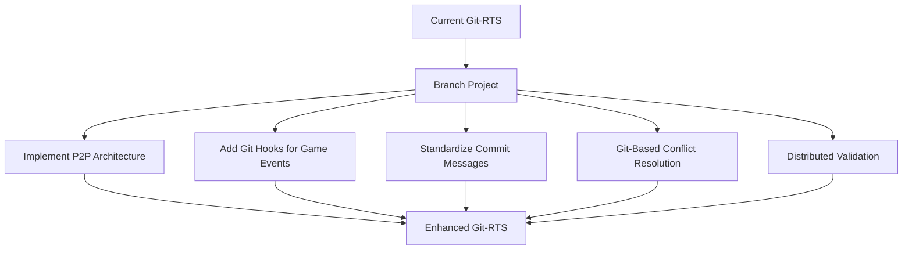
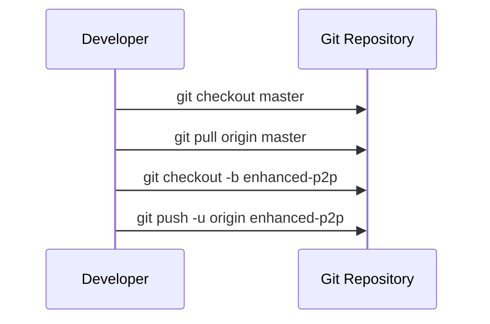
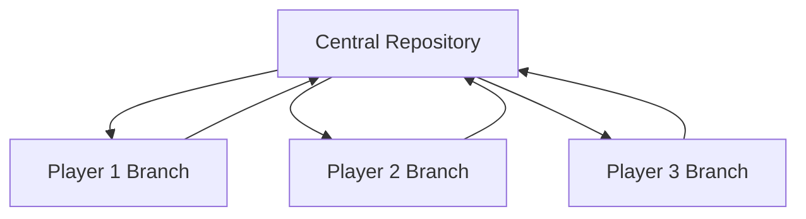
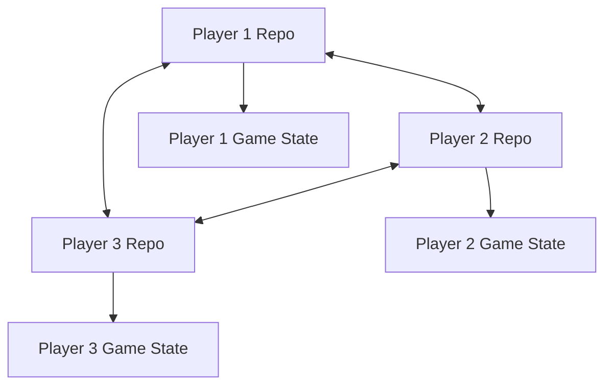
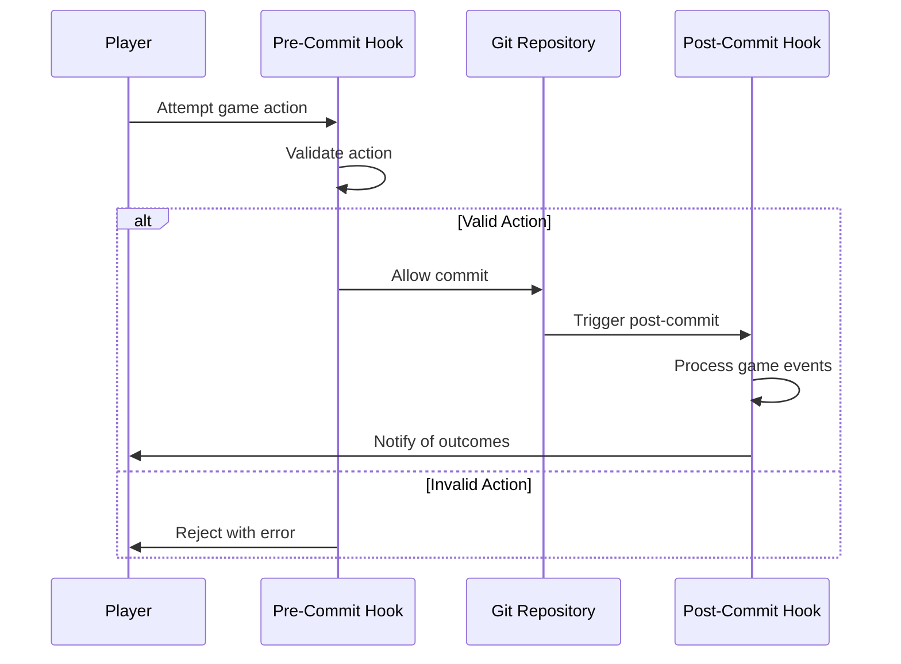
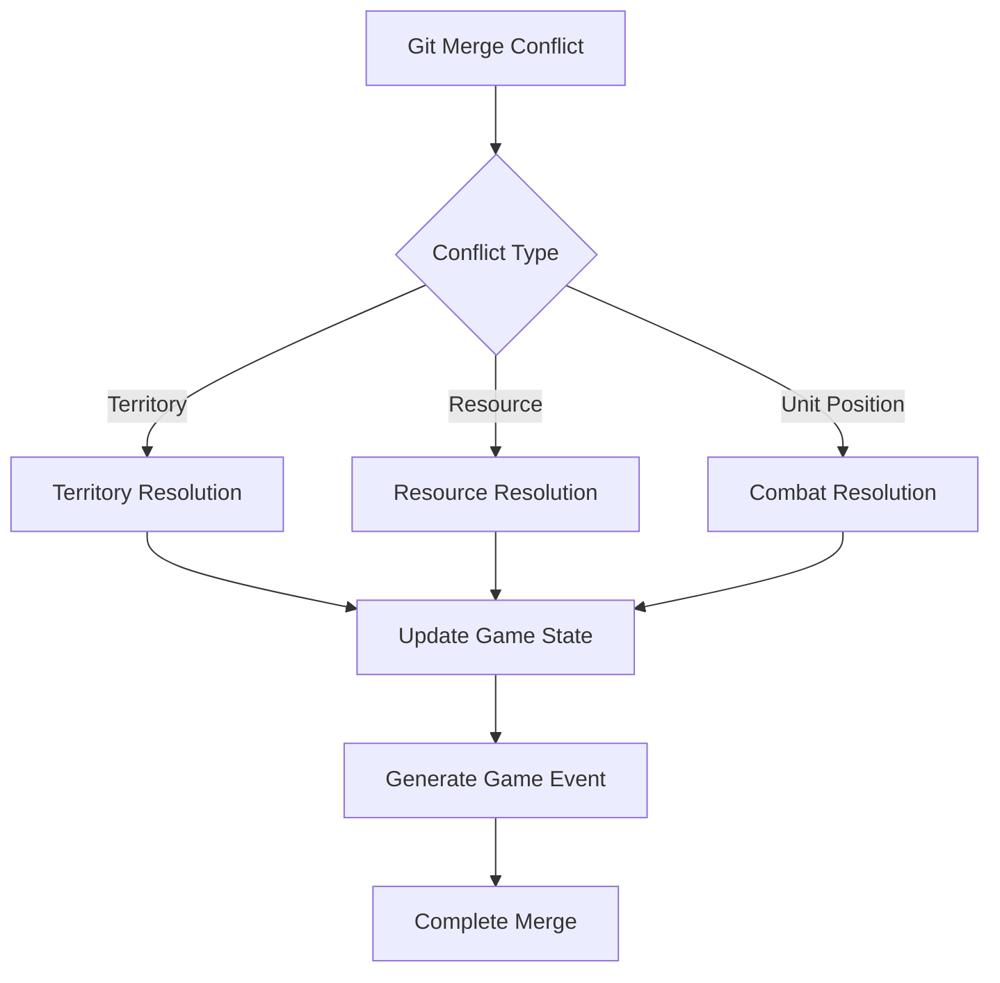
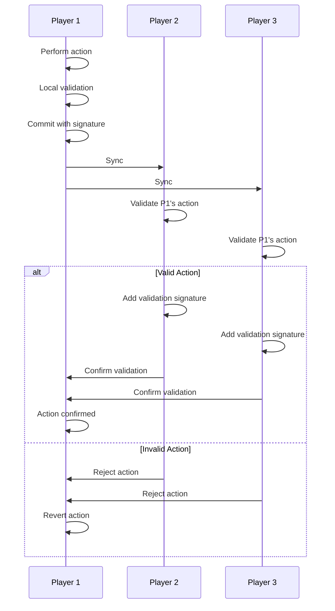

# Git-RTS Enhancement Plan: Decentralized Architecture & Advanced Git Integration

## Overview

This document outlines the plan for enhancing Git-RTS with improved decentralization and more effective utilization of Git features for gameplay mechanics.



## 1. Project Branching & Setup

### Steps:
1. Create a new branch from the current master: `enhanced-p2p`
2. Set up development environment for the enhanced version
3. Update project documentation to reflect the new architecture



## 2. True Peer-to-Peer Architecture

### Current Architecture:


### Enhanced P2P Architecture:


### Implementation:
1. Modify the repository structure to support direct peer connections
   - Create a peers.json file to track other players' repositories
   - Implement remote management functions to add/remove peers

2. Update synchronization mechanism
   - Replace central pull/push with peer-to-peer fetch/merge operations
   - Implement a discovery mechanism for finding other players' repositories

3. Create a peer management interface
   - Add commands for adding/removing peers
   - Implement peer status checking

## 3. Git Hooks for Game Mechanics

### Implementation:
1. Create a hooks directory with template hooks
   - pre-commit: Validate game actions before committing
   - post-commit: Trigger game events after commit
   - pre-merge: Validate game state before merging
   - post-merge: Update game state after merging

2. Implement game event triggers
   - Resource discovery on commit
   - Random events based on commit patterns
   - Achievement unlocks based on commit history

3. Create a hook installation mechanism
   - Add a command to install/update hooks
   - Ensure hooks are synchronized across peers



## 4. Standardized Commit Message Conventions

### Implementation:
1. Define a structured commit message format
   ```
   [ACTION_TYPE] <entity_id>: <action_details>
   
   Location: {x: X, y: Y}
   Resources: {gold: G, wood: W, stone: S, food: F}
   Target: <target_entity_id>
   ```

2. Create commit message templates for different action types
   - MOVE: Unit movement
   - GATHER: Resource gathering
   - BUILD: Construction
   - TRAIN: Unit training
   - RESEARCH: Technology research
   - ATTACK: Combat actions

3. Implement a commit message parser
   - Extract action data from commit messages
   - Use for game state reconstruction
   - Enable game log generation from Git history

## 5. Git-Based Conflict Resolution Mechanics

### Implementation:
1. Define conflict scenarios in game terms
   - Territory control conflicts
   - Resource competition
   - Unit positioning conflicts

2. Create conflict resolution rules
   - Deterministic resolution based on unit stats
   - Resource splitting algorithms
   - Territory control mechanics

3. Implement merge strategies
   - Custom merge drivers for different game entities
   - Conflict resolution that produces game events
   - History-aware merging that considers past actions



## 6. Distributed Validation

### Implementation:
1. Create a rule validation system
   - Define game rules in a machine-readable format
   - Implement validators for different action types
   - Create test cases for validation

2. Implement consensus mechanisms
   - Require multiple peers to validate major actions
   - Create a validation chain in commit history
   - Implement reputation system for validators

3. Add cryptographic verification
   - Sign game actions with player keys
   - Verify signatures during synchronization
   - Prevent tampering with game history



## Implementation Timeline

1. **Phase 1: Project Setup & Architecture (2 weeks)**
   - Branch project
   - Set up development environment
   - Design detailed architecture

2. **Phase 2: Core P2P Functionality (3 weeks)**
   - Implement peer management
   - Create P2P synchronization
   - Test basic P2P functionality

3. **Phase 3: Git Integration (3 weeks)**
   - Implement Git hooks
   - Create commit message standards
   - Develop custom merge strategies

4. **Phase 4: Game Mechanics (4 weeks)**
   - Implement conflict resolution
   - Create distributed validation
   - Integrate with game rules

5. **Phase 5: Testing & Refinement (2 weeks)**
   - Comprehensive testing
   - Performance optimization
   - Documentation

## Technical Considerations

1. **Git Limitations**
   - Handle large repositories efficiently
   - Manage concurrent operations
   - Address network connectivity issues

2. **Security Concerns**
   - Prevent cheating through history manipulation
   - Secure peer-to-peer communications
   - Validate game actions cryptographically

3. **User Experience**
   - Simplify complex Git operations for players
   - Provide clear feedback on synchronization
   - Make conflict resolution transparent